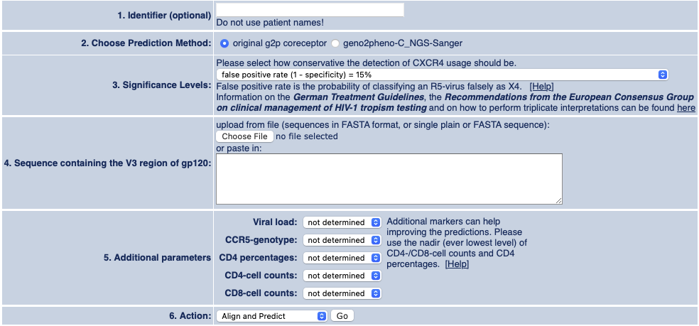

# geno2pheno

Application to automate running sequences through Geno2Pheno Coreceptor pipeline.

## Web Page

Sequences can be submitted using this process at <a target="_BLANK" href="https://primer-id.org/coreceptor">https://primer-id.org/coreceptor</a>

## Settings

All settings are default except for Significance Levels which are set to 15%.



## Setup

This version of Python and Selenium automagically install drivers and dependencies.

```bash
docker-compose build && docker-compose up
```

## Running

```bash
python3 selenium_python_geno2pheno.py ./input/unaligned_input.fasta named_output
```

The first argument can be a fasta file or directory of fasta files.

### Run Test

```bash
python3 test.py
```
